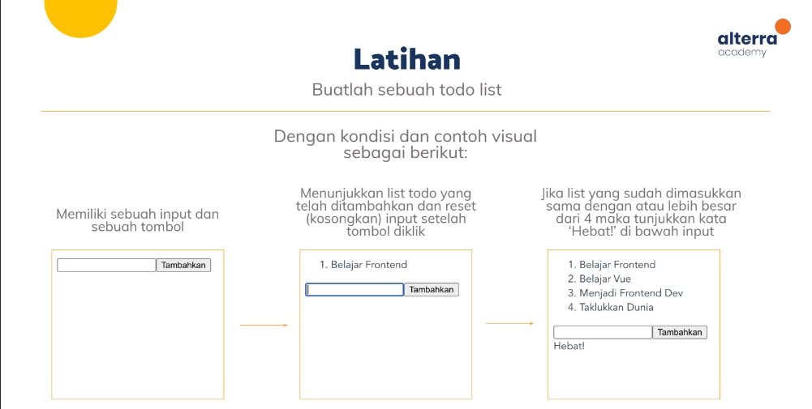

# Dasar-Dasar Vue
Repositori ini berisi jawaban untuk latihan dasar-dasar VueJs pada materi pelatihan hari ke-2 program kartu Prakerja. Materi tersebut membahas mengenai setup vue melalu CDN dan vue-cli, vue data bindings, vue directives, events and methods, computed properties and watchers, dan Components.

[Lihat solusi](https://nur-m-arief-k.github.io/vuejs-prakerja-lat-2/)

## Latihan 1:

